# Midterm Exam

Physics Topics
1st Exam

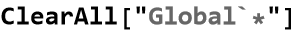

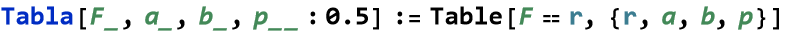

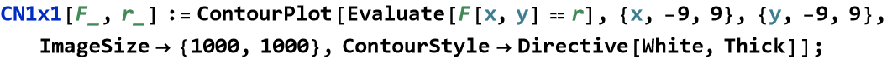

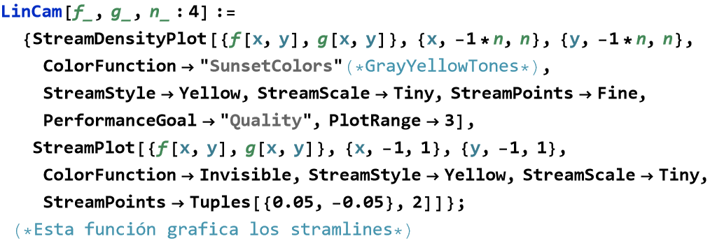

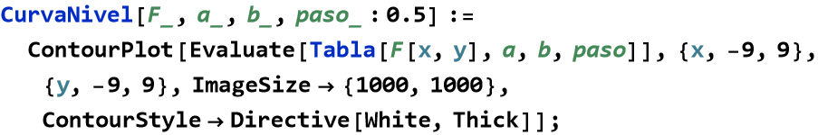

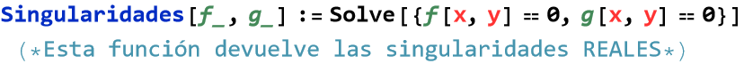

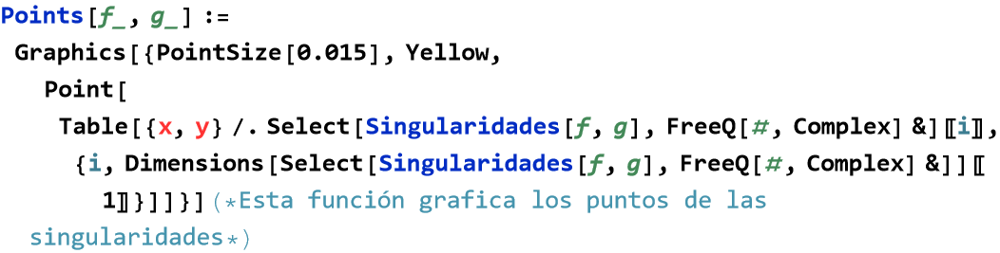

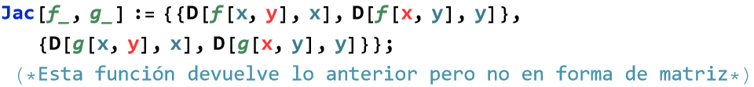

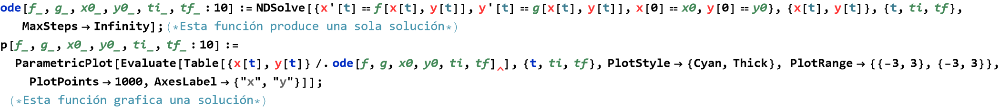

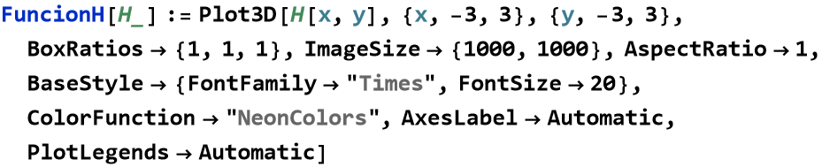

## Question 2

a) Establish the system corresponding to the Hamiltonian function:

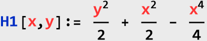

Analyze the singularities, establish through level curves, the phase portrait, and plot the Hamiltonian function.

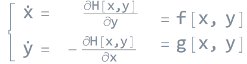

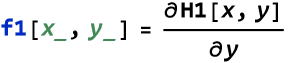

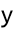

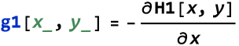

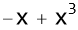

Locating the singularities:

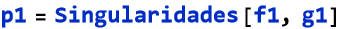

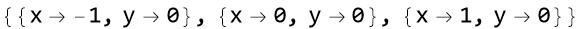

Analyzing the singularities

In this case, there are 3 singularities. Establishing the Jacobian matrix:

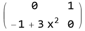

Evaluating the Jacobian matrix at P1:

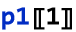

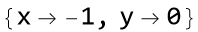

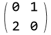

Obtaining the eigenvalues:

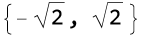

We observe that it is a hyperbolic singular point, and the Hartman theorem can be applied. In the linear system resulting from the linearization in a neighborhood of P1(-1,0), the singularity (translated to the origin) has a qualitative behavior of a "saddle."

Evaluating the Jacobian matrix at P2:

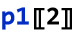

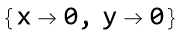

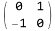

Obtaining the eigenvalues:

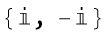

We observe that it is not a hyperbolic singular point, and the Lyapunov theorem can be applied. Let's try with \(V(x,y) = H(x,y) = \sqrt{x^2 + y^2}\).

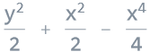

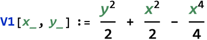

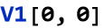

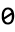

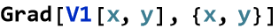

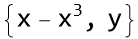

Evaluating the Jacobian matrix at P3:

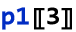

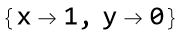

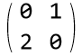

Obtaining the eigenvalues:

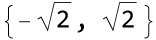

We observe that it is a hyperbolic singular point, and the Hartman theorem can be applied. In the linear system resulting from the linearization in a neighborhood of P3(1,0), the singularity (translated to the origin) has a qualitative behavior of a "saddle."

Graphing:

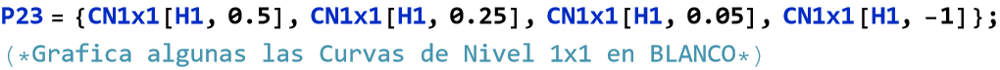

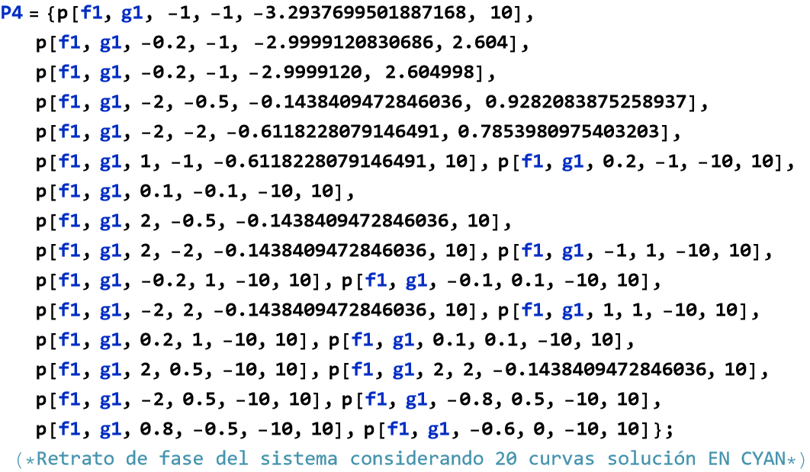

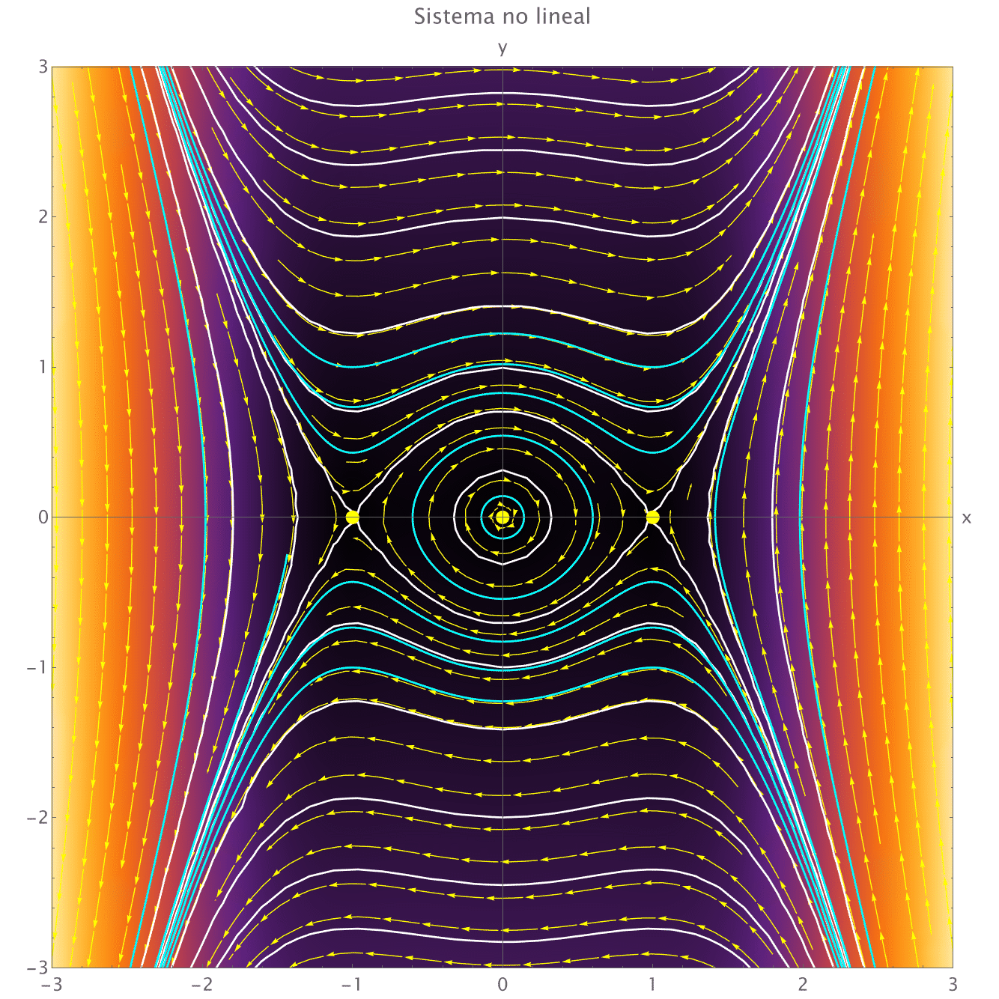

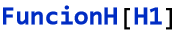

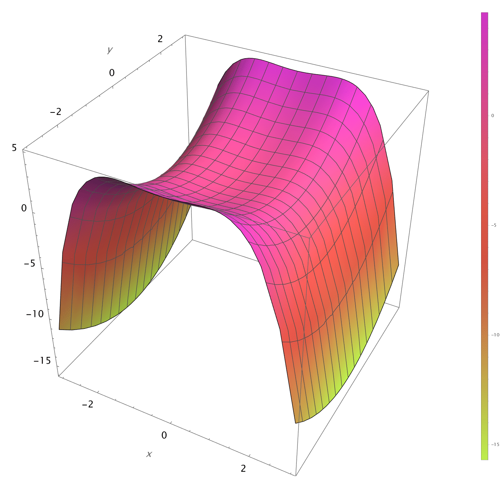

b) Analyze if the following system is a Hamiltonian system. If affirmative, analyze its singularities, establish the phase portrait through level curves, and plot the corresponding Hamiltonian function:

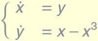 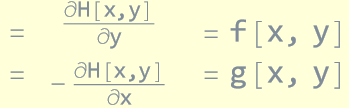

Defining the component functions of the vector field associated with the system:

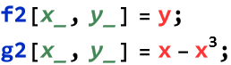

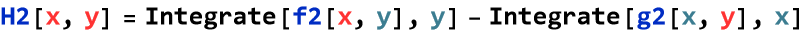

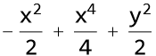

Locating the singularities:

Analyzing the singularities

In this case, there are 3 singularities. Establishing the Jacobian matrix:

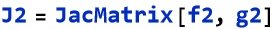

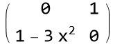

Evaluating the Jacobian matrix at P1:

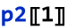

Obtaining the eigenvalues:

We observe that it is not a hyperbolic singular point.

Evaluating the Jacobian matrix at P2:

Obtaining the eigenvalues:

We observe that it is a hyperbolic singular point, and the Hartman theorem can be applied. In the linear system resulting from the linearization in a neighborhood of P2(0,0), the singularity has a qualitative behavior of a "saddle."

Evaluating the Jacobian matrix at P3:

Obtaining the eigenvalues:

We observe that it is a non-hyperbolic singular point.

Graphing:

[Created with the Wolfram Language](http://www.wolfram.com/language/)
