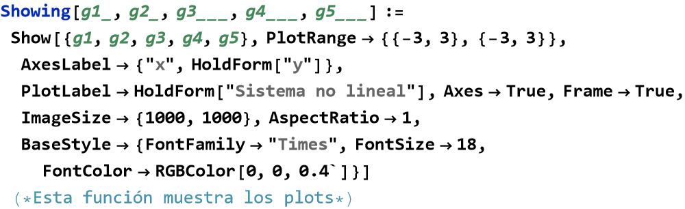
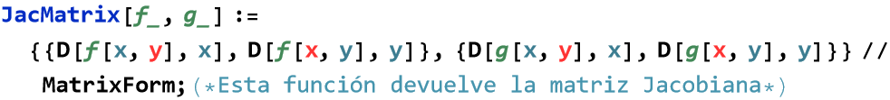
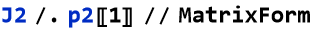

parcial 

Temas de Física  
1er Examen

Pregunta 2

a) Establecer el sistema correspondiente a la función Hamiltoniana:

analizar las singularidades , establecer mediante curvas de nivel, el retrato de fase y graficar la función Hamiltoniana.

Ubicando las singularidades:

Analizando las singularidades

En este caso hay 3 singularidades. Estableciendo la matriz Jacobiana:

Evaluando la matriz Jacobiana en P1:

Obteniendo los autovalores:

Observamos que es un punto singular hiperbólico  y se puede aplicar el teorema de Hartman. En el sistema lineal resultado de la linealización en un entrono cercano a P1(-1,0), la singularidad (trasladada al origen) tiene un comportamiento cualitativo de tipo “ensilladura”.

Evaluando la matriz Jacobiana en P2:

Obteniendo los autovalores:

Observamos que no es un punto singular hiperbólico  y se puede aplicar el Teorema de Lyapunov. Provemos con V(x,y)= H(x,y)= 

  
Evaluando la matriz Jacobiana en P3:

Obteniendo los autovalores:

Observamos que es un punto singular hiperbólico  y se puede aplicar el teorema de Hartman. En el sistema lineal resultado de la linealización en un entrono cercano a P3(1,0), la singularidad (trasladada al origen) tiene un comportamiento cualitativo de tipo "ensilladura".

Graficando:

         

b) Analizar si el siguiente sistema es un sistema Hamiltoniano. En caso afirmativo, analizar sus singularidades, establecer el retrato de fase mediante curvas de nivel y  graficar la función Hamiltoniana corresponde:

 

Definiendo las funciones componentes del campo vectorial asociado al sistema:

Ubicando las singularidades:

Analizando las singularidades

En este caso hay 3 singularidades. Estableciendo la matriz Jacobiana:

Evaluando la matriz Jacobiana en P1:

Obteniendo los autovalores:

Observamos que no es un punto singular hiperbólico .  

Evaluando la matriz Jacobiana en P2:

Obteniendo los autovalores:

Observamos que es un punto singular hiperbólico  y se puede aplicar el teorema de Hartman. En el sistema lineal resultado de la linealización en un entrono cercano a P2(0,0), la singularidad tiene un comportamiento cualitativo de tipo “ensilladura”.

Evaluando la matriz Jacobiana en P3:

Obteniendo los autovalores:

Observamos que es un punto no singular hiperbólico .

Graficando:

         

[Created with the Wolfram Language](http://www.wolfram.com/language/)
